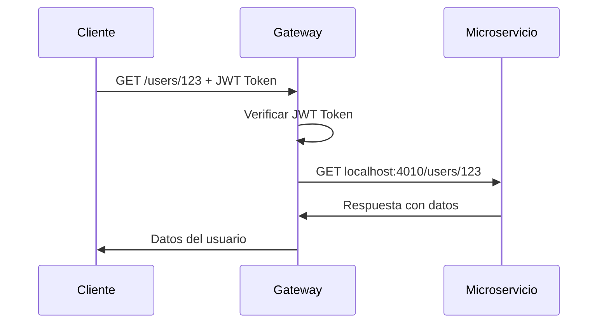

# 🌐 API Gateway - Scriptum

## 📋 ¿Qué es un API Gateway?

Un **API Gateway** es como un "portero inteligente" para tus microservicios. Es el punto único de entrada que:

1. **Recibe** todas las peticiones de los clientes
2. **Autentica** a los usuarios cuando es necesario
3. **Enruta** cada petición al microservicio correcto
4. **Devuelve** la respuesta al cliente

## 🏗️ Arquitectura del Proyecto

```
📁 gateway/
├── 📁 config/           # Configuración de servicios
│   └── services.js      # URLs y configuración JWT/CORS
├── 📁 middleware/       # Middlewares reutilizables
│   └── auth.js         # Autenticación JWT
├── 📁 routes/          # Rutas organizadas por servicio
│   ├── users.routes.js      # Rutas de usuarios
│   ├── entries.routes.js    # Rutas de entries
│   ├── user-context.routes.js # Rutas de contexto
│   ├── chat.routes.js       # Rutas de chat
│   └── email.routes.js      # Rutas de email
└── 📁 utils/           # Utilidades
    └── proxy.js        # Lógica de proxy HTTP
```

## 🚀 Cómo Iniciar el Gateway

### 1. Instalar dependencias (si es necesario)
```bash
npm install axios
```

### 2. Iniciar en modo desarrollo
```bash
npm run gateway:dev
```

### 3. Iniciar en modo producción
```bash
npm run gateway:start
```

## 🔧 Configuración

### Variables de Entorno (.env)
```env
# Puerto del Gateway
PORT=4000

# URLs de los Microservicios
USER_SERVICE_URL=http://localhost:4010
ENTRY_SERVICE_URL=http://localhost:4020
USER_CONTEXT_SERVICE_URL=http://localhost:4030
CHAT_SERVICE_URL=http://localhost:4040
EMAIL_SERVICE_URL=http://localhost:4050

# JWT Configuration
JWT_SECRET=secret-key-for-jwt
JWT_ACCESS_SECRET=secret-key-for-jwt-access

# CORS
CLIENT_URL=http://localhost:3000
```

## 📡 Servicios Disponibles

| Servicio | Puerto | Descripción |
|----------|--------|-------------|
| **Gateway** | 4000 | Punto único de entrada |
| **Users** | 4010 | Gestión de usuarios |
| **Entries** | 4020 | Gestión de entries/posts |
| **User Context** | 4030 | Contexto adicional de usuarios |
| **Chat** | 4040 | Mensajería entre usuarios |
| **Email** | 4050 | Envío de correos |

## 🛣️ Rutas del Gateway

### 🔍 Health Check
```http
GET /health
```
Verifica que el gateway está funcionando.

### 👥 Usuarios (/users)

#### Sin Autenticación:
```http
POST /users           # ✅ Crear usuario (registro)
POST /users/login     # ✅ Login de usuario  
GET /users/health     # ✅ Health check del servicio
```

#### Con Autenticación:
```http
GET /users/:id           # 🔒 Obtener usuario por ID
GET /users/email/:email  # 🔒 Obtener usuario por email
PUT /users/:id           # 🔒 Actualizar usuario
DELETE /users/:id        # 🔒 Eliminar usuario
```

### 📝 Entries (/entries)

#### Todas Con Autenticación:
```http
GET /entries              # 🔒 Obtener todas las entries
GET /entries/:id          # 🔒 Obtener entry por ID
POST /entries             # 🔒 Crear nueva entry
PUT /entries/:id          # 🔒 Actualizar entry
DELETE /entries/:id       # 🔒 Eliminar entry
GET /entries/user/:userId # 🔒 Entries de un usuario
```

### 🔍 User Context (/user-context)

#### Todas Con Autenticación:
```http
GET /user-context/:userId              # 🔒 Obtener contexto
POST /user-context                     # 🔒 Crear contexto
PUT /user-context/:userId              # 🔒 Actualizar contexto
GET /user-context/:userId/preferences  # 🔒 Obtener preferencias
```

### 💬 Chat (/chat)

#### Todas Con Autenticación:
```http
GET /chat/conversations/:userId      # 🔒 Conversaciones de usuario
GET /chat/messages/:conversationId   # 🔒 Mensajes de conversación
POST /chat/messages                  # 🔒 Enviar mensaje
POST /chat/conversations             # 🔒 Crear conversación
```

### 📧 Email (/email)

#### Sin Autenticación:
```http
POST /email/send-reset-password  # ✅ Enviar reset password
POST /email/verify-email         # ✅ Enviar verificación (opcional auth)
```

#### Con Autenticación:
```http
POST /email/send-notification    # 🔒 Enviar notificación
GET /email/templates             # 🔒 Obtener plantillas
```

## 🔐 Autenticación

### Cómo Funciona
1. El usuario hace login en `/users/login`
2. El servicio de usuarios devuelve un JWT token
3. El token se guarda en cookies o localStorage
4. Para rutas protegidas (🔒), el gateway verifica el token

### Tipos de Autenticación

#### `authenticateToken`
- **Uso**: Rutas que REQUIEREN autenticación
- **Comportamiento**: Si no hay token → Error 401

#### `optionalAuth`  
- **Uso**: Rutas que pueden funcionar con o sin token
- **Comportamiento**: Si no hay token → Continúa sin usuario

## 🔄 Flujo de una Petición



## 📝 Ejemplo de Uso

### 1. Registro de Usuario (Sin Auth)
```bash
curl -X POST http://localhost:4000/users \
  -H "Content-Type: application/json" \
  -d '{
    "name": "Juan Pérez",
    "email": "juan@email.com",
    "password": "123456"
  }'
```

### 2. Login (Sin Auth)
```bash
curl -X POST http://localhost:4000/users/login \
  -H "Content-Type: application/json" \
  -d '{
    "email": "juan@email.com",
    "password": "123456"
  }'
```

### 3. Obtener Usuario (Con Auth)
```bash
curl -X GET http://localhost:4000/users/123 \
  -H "Authorization: Bearer YOUR_JWT_TOKEN"
```

## 🚨 Manejo de Errores

El gateway maneja errores de forma consistente:

```json
{
  "message": "Descripción del error",
  "timestamp": "2024-01-15T10:30:00.000Z"
}
```

### Códigos de Error Comunes:
- **401**: Token requerido o faltante
- **403**: Token inválido o expirado  
- **404**: Ruta no encontrada
- **500**: Error interno del servidor
- **503**: Servicio no disponible

## 💡 Ventajas del API Gateway

1. **Punto único de entrada**: Un solo lugar para manejar todas las peticiones
2. **Autenticación centralizada**: No duplicar lógica JWT en cada servicio
3. **Enrutamiento inteligente**: Cada petición va al servicio correcto
4. **Fácil escalabilidad**: Agregar nuevos servicios es sencillo
5. **Manejo de errores consistente**: Respuestas uniformes
6. **CORS centralizado**: Una configuración para todos los servicios

## 🛠️ Para Desarrolladores

### Agregar un Nuevo Servicio

1. **Agregar URL en `config/services.js`**:
```javascript
export const SERVICES = {
  // ... otros servicios
  NEW_SERVICE: process.env.NEW_SERVICE_URL || 'http://localhost:4060'
};
```

2. **Crear archivo de rutas en `routes/`**:
```javascript
// routes/new-service.routes.js
import express from 'express';
import { authenticateToken } from '../middleware/auth.js';
import { proxyRequest, buildServiceUrl } from '../utils/proxy.js';
import { SERVICES } from '../config/services.js';

const router = express.Router();

router.get('/', authenticateToken, async (req, res) => {
  try {
    const targetUrl = buildServiceUrl(SERVICES.NEW_SERVICE, '/new-service');
    const result = await proxyRequest(req, targetUrl);
    res.status(result.status).json(result.data);
  } catch (error) {
    res.status(error.status || 500).json(error.data || { 
      message: 'Error en nuevo servicio' 
    });
  }
});

export default router;
```

3. **Registrar en `gateway-app.js`**:
```javascript
import newServiceRouter from './gateway/routes/new-service.routes.js';
app.use('/new-service', newServiceRouter);
```

### Debugging

Para ver las peticiones que pasa el gateway, está configurado Morgan:
```bash
npm run gateway:dev
# Mostrará todas las peticiones HTTP en consola
```

## 🎯 Próximos Pasos

1. **Rate Limiting**: Agregar límites de peticiones por usuario
2. **Caching**: Cachear respuestas frecuentes
3. **Load Balancing**: Balancear carga entre múltiples instancias
4. **Monitoring**: Métricas y monitoreo de servicios
5. **API Versioning**: Soporte para versiones de API

¡Tu API Gateway está listo para usar! 🚀
